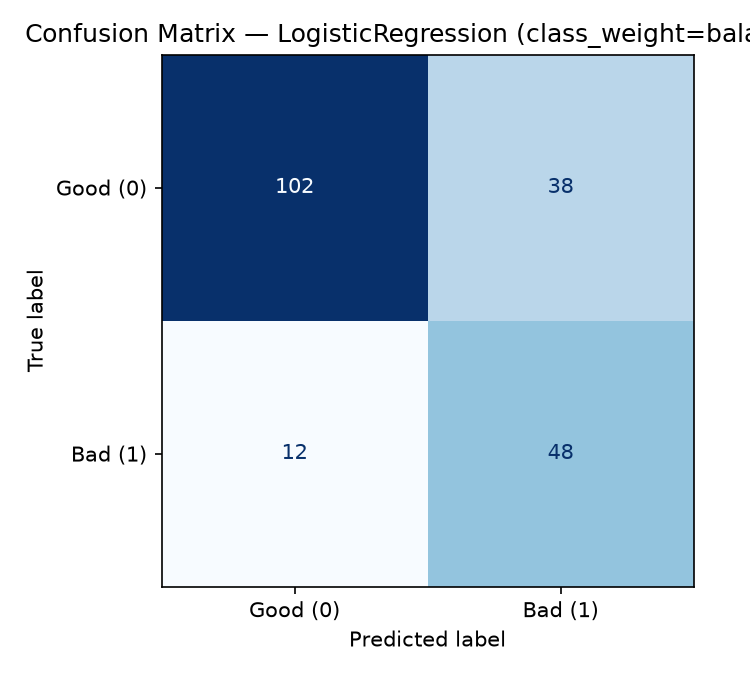
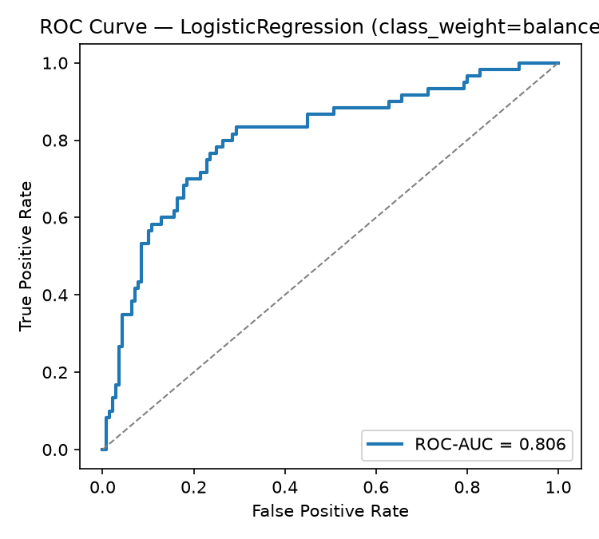

# 💳 Credit Risk Modelling

Predicting loan-default risk from applicant data using Logistic Regression and Random Forest, with a live Streamlit app for interactive predictions.

**🔗 Live Demo:** [credit-risk-modelling.streamlit.app](https://credit-risk-modelling-pde4btnusaxmiiip6c7eou.streamlit.app/)

---

## Problem Statement

Banks and lenders need to estimate the probability that a loan applicant will **default** before approving credit. This project builds and compares several classification models on the classic German Credit dataset to predict `credit_risk` (good vs. bad) from an applicant's financial and demographic profile, and ships the winning model behind a simple web form.

## Dataset

**UCI Statlog (German Credit Data)** — 1,000 loan applicants, 20 attributes (mix of categorical and numeric) plus a binary target.

- Source: [archive.ics.uci.edu/ml/machine-learning-databases/statlog/german](https://archive.ics.uci.edu/ml/machine-learning-databases/statlog/german/german.data)
- Target recoded for modelling: `0` = good / no default, `1` = bad / default (raw file uses `1`/`2`)
- Class distribution: **700 good / 300 bad** — a real-world, moderately imbalanced credit dataset
- Categorical fields use coded values (e.g. `A11`, `A12`, ...) per the [official UCI documentation](https://archive.ics.uci.edu/ml/machine-learning-databases/statlog/german/german.doc); human-readable mappings for the fields exposed in the app live in `mappings.py`

## Approach

1. **EDA** — inspect class balance, confirm the ~2.3:1 good/bad imbalance (`train.py`).
2. **Preprocessing / feature engineering** — `ColumnTransformer` one-hot encodes the 13 nominal categorical columns and `StandardScaler`-normalizes the 7 numeric columns (duration, credit amount, age, installment rate, residence duration, existing credits, dependents). Wrapped in an `sklearn.Pipeline` so preprocessing is saved together with the model.
3. **Class-imbalance handling** — compared two strategies head-to-head:
   - `class_weight="balanced"` (no resampling)
   - **SMOTE** oversampling applied only to the training fold, via an `imblearn.pipeline.Pipeline` (never touches the test set, avoiding leakage)
4. **Model comparison** — Logistic Regression and Random Forest, each with both imbalance strategies (4 variants total), trained on an 80/20 stratified split (`random_state=42`).
5. **Selection** — the variant with the highest **ROC-AUC** on the held-out test set is saved as the production model (`models/model.joblib`).

## Results

| Variant | Accuracy | Precision | Recall | F1 | ROC-AUC |
|---|---|---|---|---|---|
| **LogisticRegression (class_weight=balanced)** | **0.750** | **0.5581** | **0.8000** | **0.6575** | **0.8058** |
| LogisticRegression + SMOTE | 0.745 | 0.5529 | 0.7833 | 0.6483 | 0.7967 |
| RandomForest (class_weight=balanced) | 0.745 | 0.5714 | 0.6000 | 0.5854 | 0.7983 |
| RandomForest + SMOTE | 0.755 | 0.6341 | 0.4333 | 0.5149 | 0.7877 |

**Winner: Logistic Regression with `class_weight="balanced"`** — highest ROC-AUC (0.806) and highest recall (0.80) on the bad-credit class, which matters most for risk screening (missing an actual default is costlier than a false alarm). Full metrics are regenerated by `train.py` into `reports/metrics.json`.

**Confusion Matrix** (final model, held-out test set):



**ROC Curve** (final model, held-out test set):



## Tech Stack

- **Python 3** — pandas, numpy
- **scikit-learn** — `Pipeline`, `ColumnTransformer`, `LogisticRegression`, `RandomForestClassifier`, metrics
- **imbalanced-learn** — `SMOTE`, `imblearn.pipeline.Pipeline`
- **matplotlib / seaborn** — confusion matrix & ROC curve plots
- **joblib** — model persistence
- **Streamlit** — interactive web app / demo UI

## Run locally

```bash
git clone https://github.com/uurbanbuddha/credit-risk-modelling.git
cd credit-risk-modelling

python3 -m venv .venv
source .venv/bin/activate
pip install -r requirements.txt

# (optional) retrain the model from scratch — regenerates models/model.joblib
# and reports/{metrics.json,confusion_matrix.png,roc_curve.png}
python3 train.py

# launch the app
streamlit run app.py
```

Then open the URL Streamlit prints (default `http://localhost:8501`).

## Project structure

```
credit-risk-modelling/
├── app.py                  # Streamlit app
├── train.py                 # data loading, preprocessing, training, evaluation
├── mappings.py               # coded-value <-> human-readable label mappings
├── data/german.data          # raw UCI dataset
├── models/model.joblib        # final trained pipeline (preprocessing + model)
├── reports/metrics.json        # metrics for all 4 model variants
├── reports/confusion_matrix.png
├── reports/roc_curve.png
├── requirements.txt
└── runtime.txt
```
